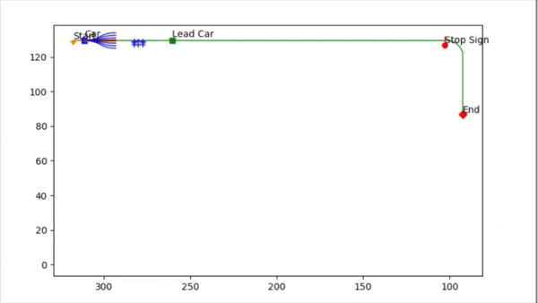

# Motion Planning for self-driving cars in CARLA

This project implements a Finite State Machine(FSM) based behavioral planner and conformal lattice planner as local planner in CARLA simulator.
The waypoints(global plan) for the track are pre-defined. Conformal lattic planner generates multiple trajectories at a certain lookahead distance using spiral optimization. 
The goal points are sampled by laterally offsetting from the goal location along the direction perpendicular to the goal yaw of the ego vehicle.
The best trajectory is filtered out in terms of various factors like distance from the centerline of lane and clearance from obstacles. 
So, the car is able to avoid both static and dynamic obstacles. Circle-based collision checking is implemented.
For velocity profile generation, trapezoidal velocity profiles are generated that can handle stop signs,
lead dynamic obstacles, as well as nominal lane maintenance, while integrating comfort constraints .The best path selected by conformal lattice planner
is then executed by the vehicle controllers, which are longitudinal and lateral PID controllers.
This project is a part of the Self-Driving Cars Specialization course in Coursera. The detail about this specialization can be found [here](https://www.coursera.org/learn/motion-planning-self-driving-cars).

## Prerequisites
The performance of the motion planner was simulated using the CARLA simulator, which is a modified version of the original CARLA simulator
with additional maps included. If you wish to try my controller yourself, please download and install this simulator following the
instructions [here](https://www.coursera.org/learn/motion-planning-self-driving-cars/supplement/i9R3x/carla-installation-guide). To learn
how to use this simulator, you can refer to the project instruction from Coursera
website [here](https://www.coursera.org/learn/motion-planning-self-driving-cars/programming/wiGwg/course-4-final-project).

## Simulation output
The clip shown below shows a sample of car motion in a city traffic. The green line is the reference global plan.
The yellow line shows the path travelled by the car. The blue lines shows the conformal lattice and red ones are the collision-prone trajectories 
which are filtered out.

  

  

